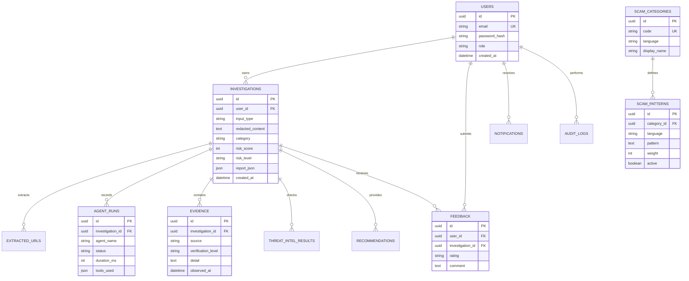

# Entity relationship diagram

```mermaid
erDiagram
  USERS ||--o{ INVESTIGATIONS : owns
  USERS ||--o{ FEEDBACK : submits
  USERS ||--o{ NOTIFICATIONS : receives
  USERS ||--o{ AUDIT_LOGS : performs
  INVESTIGATIONS ||--o{ EXTRACTED_URLS : extracts
  INVESTIGATIONS ||--o{ AGENT_RUNS : records
  INVESTIGATIONS ||--o{ EVIDENCE : contains
  INVESTIGATIONS ||--o{ THREAT_INTEL_RESULTS : checks
  INVESTIGATIONS ||--o{ RECOMMENDATIONS : provides
  INVESTIGATIONS ||--o{ FEEDBACK : receives
  SCAM_CATEGORIES ||--o{ SCAM_PATTERNS : defines

  USERS {
    uuid id PK
    string email UK
    string password_hash
    string role
    datetime created_at
  }
  INVESTIGATIONS {
    uuid id PK
    uuid user_id FK
    string input_type
    text redacted_content
    string category
    int risk_score
    string risk_level
    json report_json
    datetime created_at
  }
  AGENT_RUNS {
    uuid id PK
    uuid investigation_id FK
    string agent_name
    string status
    int duration_ms
    json tools_used
  }
  EVIDENCE {
    uuid id PK
    uuid investigation_id FK
    string source
    string verification_level
    text detail
    datetime observed_at
  }
  FEEDBACK {
    uuid id PK
    uuid user_id FK
    uuid investigation_id FK
    string rating
    text comment
  }
  SCAM_CATEGORIES {
    uuid id PK
    string code UK
    string language
    string display_name
  }
  SCAM_PATTERNS {
    uuid id PK
    uuid category_id FK
    string language
    text pattern
    int weight
    boolean active
  }
```

`eval_labels` has no relationship to `feedback`; they are intentionally separate so user feedback cannot silently become ground truth.
